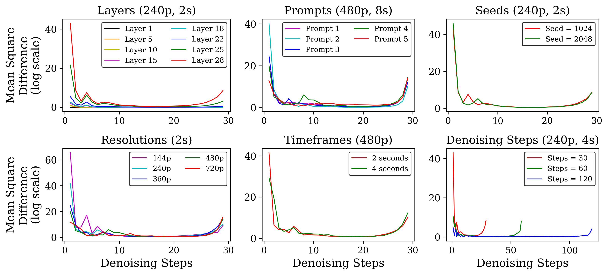
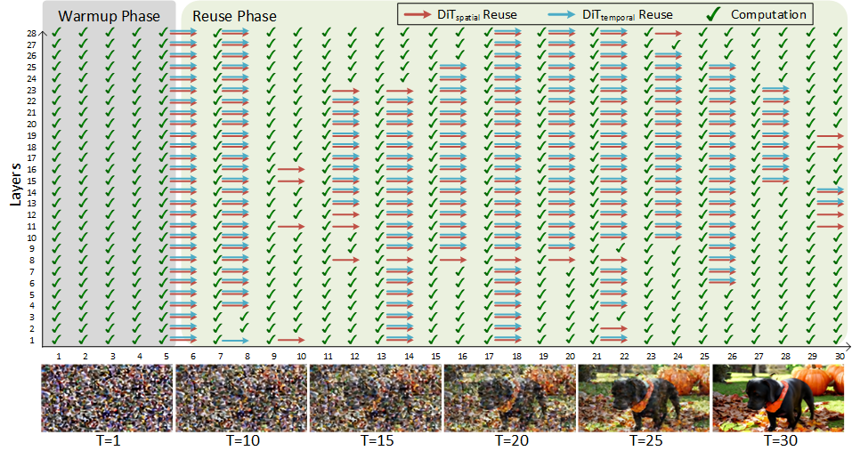
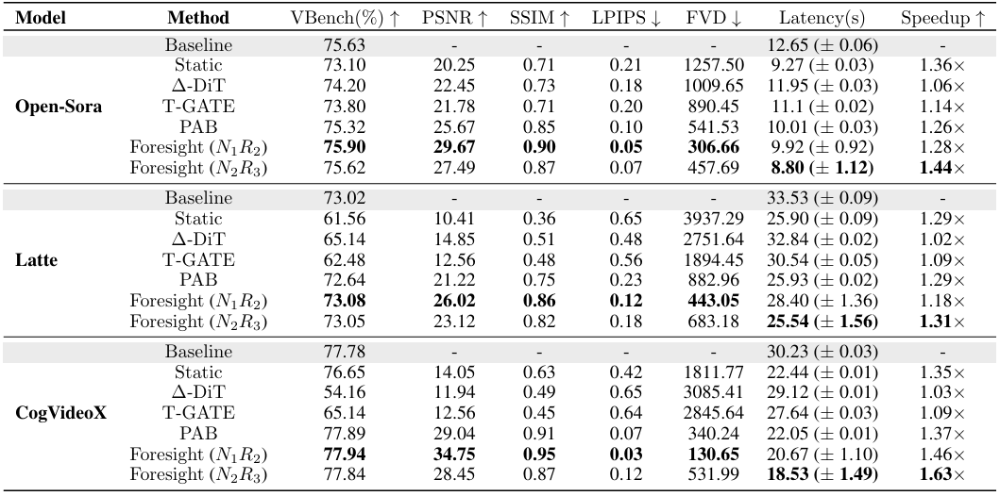
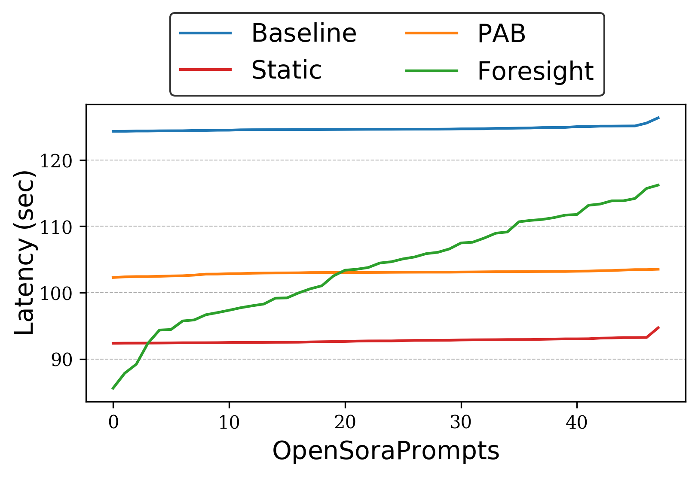
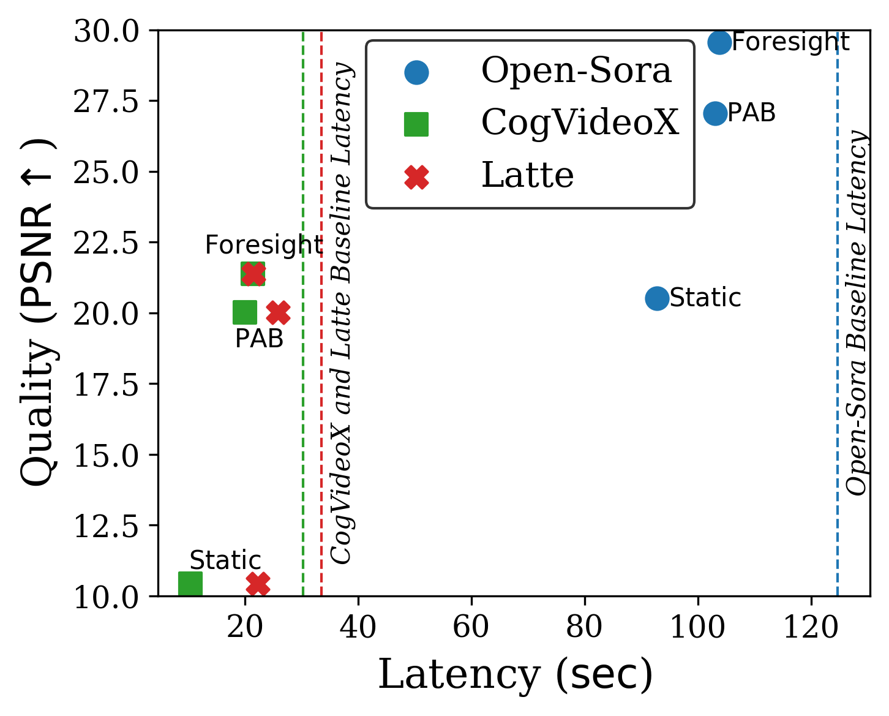

# Foresight: Adaptive Layer Reuse for Accelerated and High-Quality Text-to-Video Generation
**Muhammad Adnan<sup>*</sup><sup>1</sup>**, **Nithesh Kurella<sup>2</sup>**, **Akhil Arunkumar<sup>2</sup>**, **Prashant J. Nair<sup>1</sup>**

<sup>*</sup> Work done when the author was an intern at d-Matrix.

<sup>1</sup> Department of Electrical and Computer Engineering, The University of British Columbia, Vancouver, BC, Canada.
<sup>2</sup> d-Matrix, Santa Clara, California, USA

**TL;DR:** Diffusion Transformers (DiTs) achieve state-of-the-art results in text-to-image, text-to-video generation, and editing. However, their large model size and the quadratic cost of spatial-temporal attention over multiple denoising steps make
 video generation computationally expensive. Static caching mitigates this by reusing features across fixed steps but fails to adapt to generation dynamics, leading to suboptimal trade-offs between speed and quality. We introduce **Foresight**,  an adaptive layer-reuse technique that reduces computational redundancy across denoising steps while preserving baseline performance. **Foresight** dynamically identifies and reuses DiT block outputs for all layers across steps, adapting to generation parameters such as resolution and denoising schedules to optimize efficiency. **Foresight** achieves up to 1.63× end-to-end speedup, while maintaining video quality.

<p align="center" width="100%">
    <br>
    <em>Comparison of 720p, 6sec video generation speeds between Baseline and Foresight using CogVideoX model.</em>
</p>

## Motivation and Limitations

DiTs enable high-fidelity video synthesis. However, this comes at a high computational cost. Self-attention has quadratic complexity in the token length, which increases with both spatial resolution (more patches per frame) and temporal extent (more frames). Combined with the tens of denoising steps in typical diffusion pipelines, this leads to prohibitive inference latency for high-resolution or long-duration videos.

Feature caching offers a train-free strategy for accelerating diffusion transformers by reusing intermediate activations across adjacent denoising steps. However, feature caching apply a static, uniform reuse policy across all layers and steps, which yields limited speedup and often degrades video quality and temporal coherence. Reuse suitability in text-to-video diffusion varies along three key axes: prompt, layer, and configuration dynamics. Prompts differ in visual complexity. For instance, some prompts induce static scenes while others cause rapid changes. This leads to significant variation in feature similarity across timesteps. Static reuse applies uniform caching and cannot adapt to such prompt-specific behavior. Layer-wise sensitivity analysis shows that reusing late layers degrades quality most, as these layers exhibit greater feature variation, yet static methods fail to account for this variation. Moreover, video configuration parameters such as resolution, length, and denoising schedule can drastically alter reuse patterns, even under the same prompt. These findings underscore the limitations of static reuse under dynamic generation conditions.

Attention mechanism exhibit varying amounts of sparsity throughout the large number of model decoder layers. As seen in Figure 1(Left), attention sparsity significantly varies for models of the same sizes and all for the same CNN/DailyMail dataset summarization task. On the other hand, Figure 1(Right), through a cumulative distributive function (CDF) shows how the attention score is concentrated within a with small number of tokens during text generation. What this translates into for us is the importance of certain key tokens during token generation and more importantly, the relative irrelevance of a majority of tokens during the same.

<p align="center" width="100%">
    <br>
    <em>Figure 1: Quantitave analysis of SpatialDiT output using  mean squared difference (MSE) across different layer, seeds, video resolutions, video timeframes and denoising steps for Open-Sora model using same prompt (Layer28 if layer not specified).</em>
</p>

## Foresight

To address the limitations of static reuse, we propose **Foresight**, an adaptive layer reuse framework that balances inference speed and video generation quality. **Foresight** makes dynamic reuse decisions through a two-phase process (1) *warmup phase* and (2) *reuse phase*, driven by layer-specific reuse thresholds ($\lambda$) and reuse metrics ($\delta$).

### Warmup Phase

In contrast to prior caching methods, **Foresight** does not initialize the cache ($\mathcal{C}$) immediately after the first step. Instead, DiT blocks are computed for the first $W$ denoising steps, allowing intermediate features to stabilize. At timestep $t = W$, the cache is initialized with the latest outputs from each layer. It establishes a reuse threshold ($\lambda$) for each layer based on the mean squared error (MSE) of intermediate features between consecutive steps during the warmup phase. Let $\mathbf{x}_t$ denote features at step $t$. Given stabilized features by $t=W$, we compute thresholds as a weighted sum of MSEs from the final three warmup steps, scaled geometrically to reduce bias as shown in below Equation.

```math
\lambda_{\mathbf{x}}^l = \sum_{t=W-2}^{W} \frac{1}{10^{W-t}} \left( \frac{1}{P} \sum_{i=1}^{P} \big( \mathbf{x}_{i}^l(t) - \mathbf{x}_{i}^l(t-1) \big)^2 \right), \quad \mathbf{x} \in \{\mathbf{x}_\mathrm{spatial},\,\mathbf{x}_\mathrm{temporal}\}, \quad  l = 1,\dots,L
```

### Reuse Phase

The reuse phase employs the initialized cache ($\mathcal{C}$) and thresholds ($\lambda$), introducing a dynamic reuse metric ($\delta$) for each layer and block to guide reuse decisions. This phase alternates between reuse and recomputation steps. Specifically, reuse occurs for $N$ steps, after which all layers are recomputed for every $R$ step. The reuse metric is updated based on MSE between the current and cached features at each recomputation. This update enables \foresight~to adapt and reuse dynamically based on feature changes.

```math
\delta_{\mathbf{x}}^l(t) = \frac{1}{P}\sum_{i=1}^{P}\big(\mathbf{x}_{i}^l(t)-\mathcal{C}_{i}^l(t-1)\big)^2, \quad \mathbf{x} \in \{\mathbf{x}_\mathrm{spatial},\,\mathbf{x}_\mathrm{temporal}\}, \quad l=1,\dots,L
```

After updating the reuse metric, the cache is refreshed with the latest intermediate features. At the subsequent timestep ($t+1$), reuse decisions are made by comparing the reuse metric ($\delta$) against the threshold ($\lambda$).

<p align="center" width="100%">
    <br>
    <em>Figure 2:Example of Foresight's adaptive layer reuse for Open-Sora model for 240p, 4sec video generation with $W=15\%$.</em>
</p>

## Key Results

Below Table compares the video quality of Foresight with static reuse methods. We generate 550 videos from the [VBench](https://arxiv.org/abs/2311.17982)prompt set, covering 550 prompts across 11 dimensions (50 per dimension). Video quality is evaluated using VBench accuracy (%) and standard metrics: PSNR, SSIM, LPIPS, and FVD, all relative to the baseline.

<p align="center" width="100%">
    <br>
</p>

### Adaptive Behavior

To quantify the adaptive behavior of Foresight, Figure 3(a) presents absolute latency for all methods across prompts from the Open-Sora prompt set.Static reuse methods exhibit consistent latency due to fixed reuse schedules. In contrast Foresight balances speed and quality based on scene complexity, enabling dynamic reuse for improved video quality and inference speedup.

<p align="center" width="100%">
    
    <br>
    <em>Figure 3: (Left) Latency variation across prompts from the Open-Sora set. (Right) Inference time vs video quality.</em>
</p>

## 📝 Citation
```
@article{foresight,
  title={Foresight: Adaptive Layer Reuse for Accelerated and High-Quality Text-to-Video Generation},
  author={Adnan, Muhammad and Kurella, Nithesh and Arunkumar, Akhil and Nair, Prashant},
  year={2025},
  booktitle = {Proceedings of the 39th International Conference on Neural Information Processing Systems},
  location = {San Diego, CA, USA}
}
```
